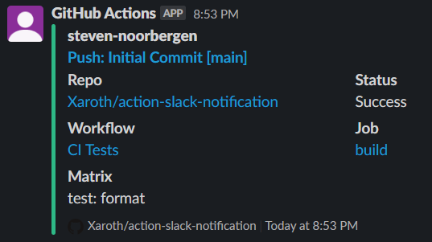

# action-slack-notification

This action sends a message to your slack channel with information about your running build. When your build completes, this action then updates the sent message to include the resulting status, with the outcome of your run.



## Usage

```yaml
uses: xaroth/action-slack-notification
with:
  channel-id: <channel id>
  slack-token: <token>
```

## Inputs

### channel-id or channel-name

The channel (either by ID or by name) to send to. Please note that if you use the `channel-name` variant, your bot account will require more access (`channels:read` and `groups:read`, respectively), so from a least-access-required perspective it is recommended to use the `channel-id` variant.

### message-id

When specified, causes the action to update the message with the specified `message-id`. This is useful if you want to update your message mid-workflow.

### slack-token

The slack token that belongs to the bot account. This token can be found under `OAuth & Permissions`, and generally starts with `xoxb-`. Please be sure to attach the right scopes; at a bare minimum it will need the `chat:write` scope (as well as you manually inviting the bot account into that channel)

### github-token

Optionally to specify a PAT to be used to access the GitHub API to retrieve the workflow status. Normally the default token provided to the action will suffice.

### matrix

Optionally to manually specify the matrix configuration. Normally the default will pick up the entire matrix flow, which should be sufficient.

This is used to be able to detect specific jobs for each matrix product, to ensure we update the message with the status of the right job.

### message-custom, message-summary and message-text

These allow you to manually specify extra text. This can be done in two ways:

- Passing the `slack-token` (and optionally `message-id` if this isn't the first call) to add the extra text to the message right away
- Not passing the `slack-token` to update the message at the end of the workflow.

The 3 variants (-custom, -summary and -text) end up in different locations:

- `-custom` is shown as an extra field (similar to Workflow and Status). Please note that adding a lot of text here might interfere with the layout of the attachment
- `-summary` is shown underneath the title/author name in the attachment.
- `-text` is shown before the attachment, and allows for more.

For both `-summary` and `-text` markdown will automatically be converted to rich text.

## Outputs

### channel-id

This is the resolved channel id to send to. This can be passed to subsequent calls to this action to avoid having to look up channel names again.

### message-id

This is the message id of the message that was sent to slack. This must be passed to subsequent calls to this action if you wish to update the existing message. Please note that you then also have to send the `slack-token` input.
